<h1>
Patient App (Spring Security)</h1>

 
Spring Security types in this project :  
<h6>- InMemoryAuthentication</h6>
<h6>- JDBC Authentication </h6>
<h6>- UserDetailsService Authentication </h6>
----------------------------------------------------------------------------------------------------------------------
 

## 1) InMemoryAuthentication

<h4>Login page</h4>

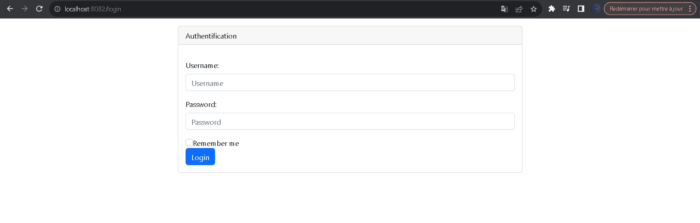

 

<h4>SecurityConfig.java</h4>

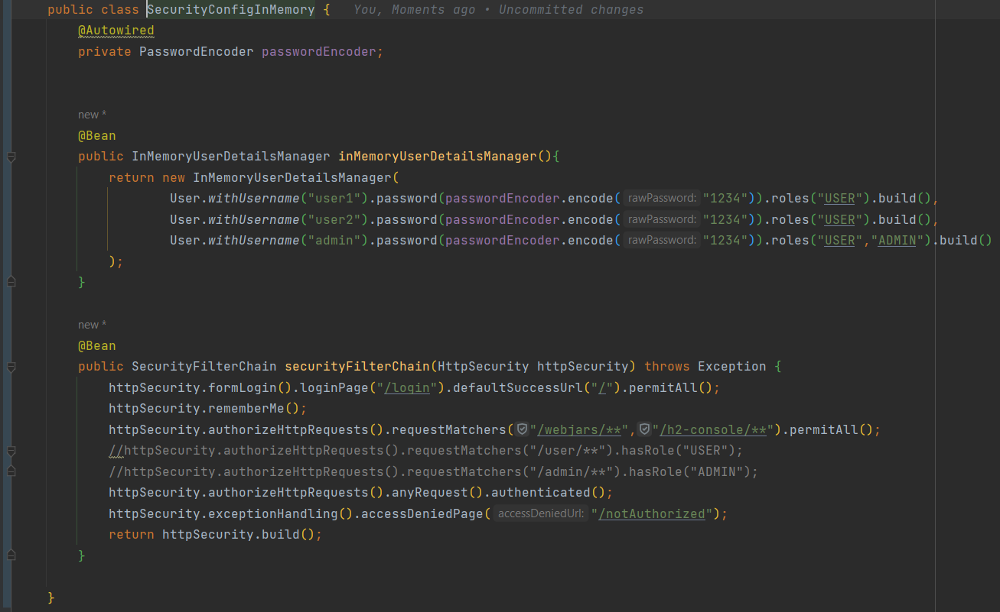

 
<h4>SecurityController.java</h4>

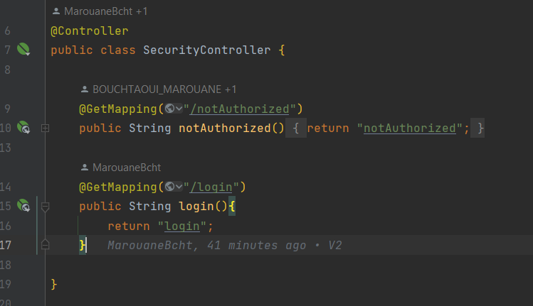

 

<h4>Login.html</h4>

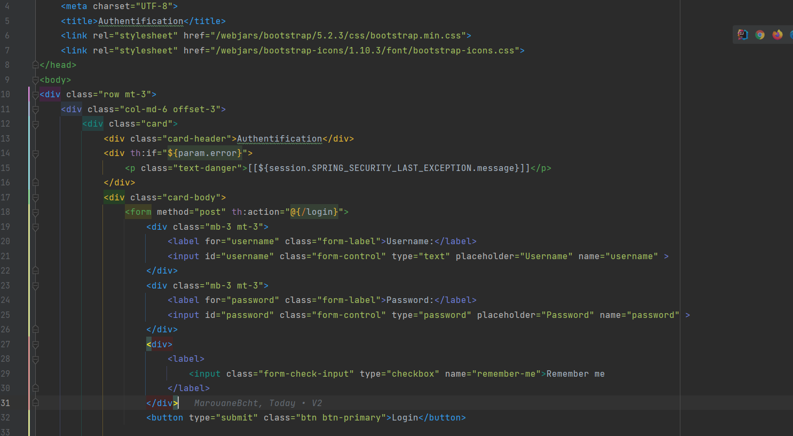

 
<h4>notAuthorized page</h4>

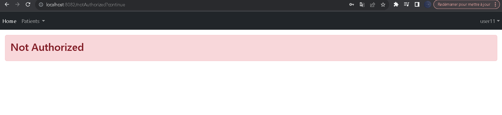

 
<h4>notAuthorized.html</h4>

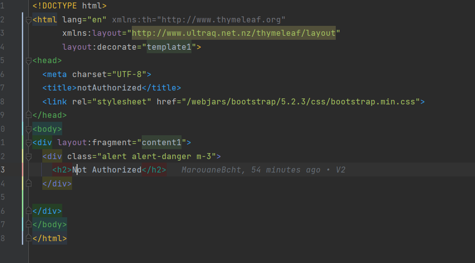

## 2) JDBC Authentication

<h4>SecurityConfigJDBC.java</h4>

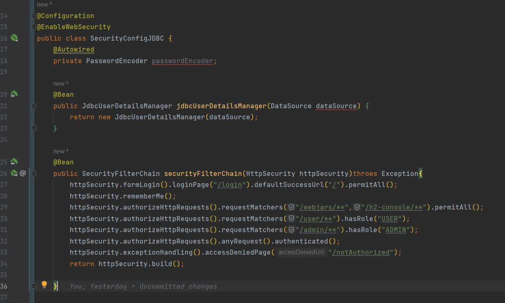

 

<h4>application.properties</h4>

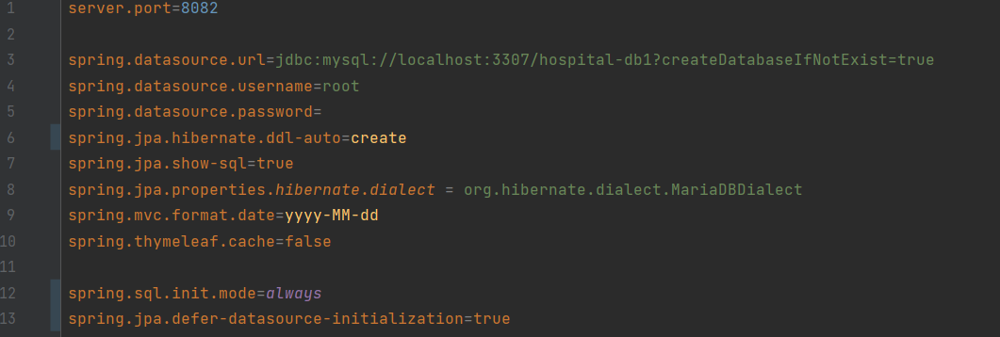

 

Pour créer (users and authorities) dans notre base de données nous allons créer un fichier "schema.sql"

<h4>schema.sql</h4>

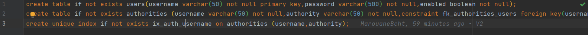

 

Création des utilisateurs et définir les roles

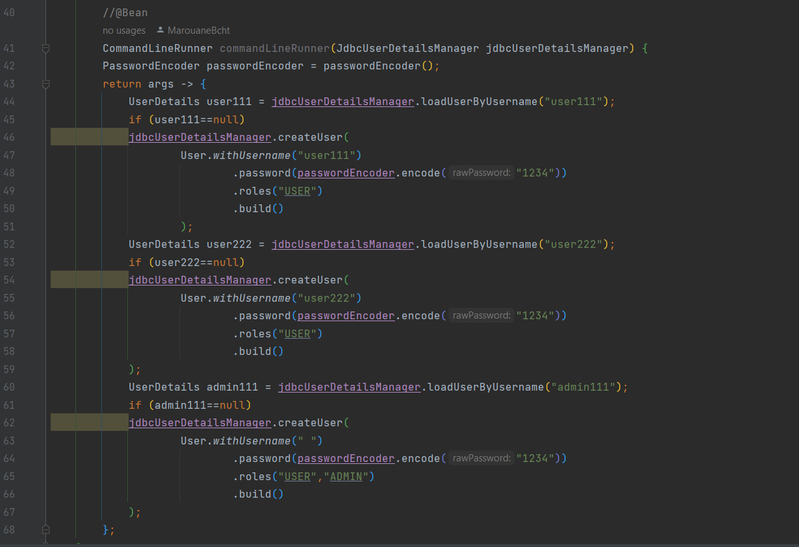

 
Nous allons utiliser un controlleur pour la gestion des paths de "login" et "notAuthorized"
<h4>SecurityController.java</h4>

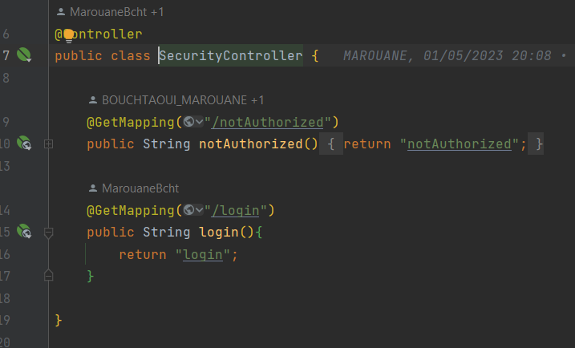

 
<h4>Login.html</h4>

 
<h4>notAuthorized page</h4>

 
Lorsqu'on demarre l'application nous avons la page "login"
<h4>1- Login page</h4>

 

## 3) UserDetailsService Authentication

 
Pour UserDetailsService Authentication nous devrons ajouter les packages: "entities, repositories et services"

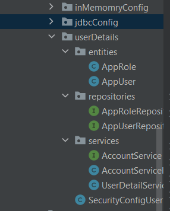

 

Pour AppUser:

<h4>AppUser.java</h4>

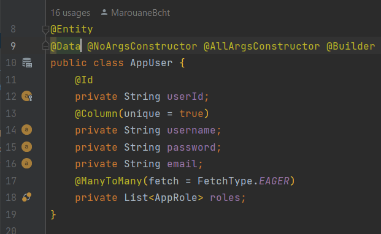

 

<h4>AppUserRepository.java</h4>

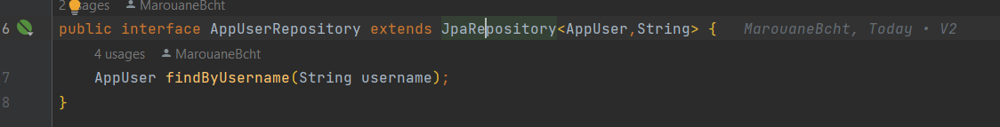

 

Pour AppRole:

<h4>AppRole.java</h4>

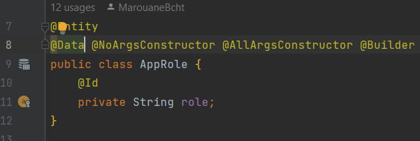

 

<h4>AppRoleRepository.java</h4>

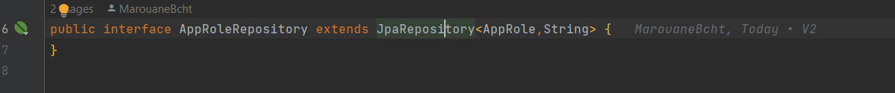

 

Pour les services:

<h4>AccountService.java</h4>

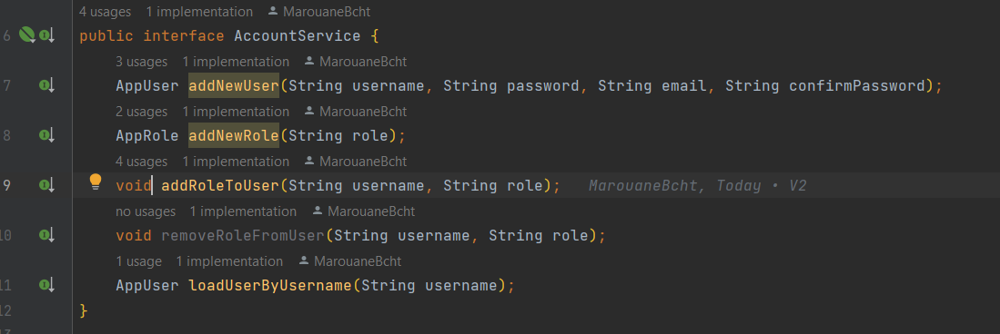

 

L'implementation des services :

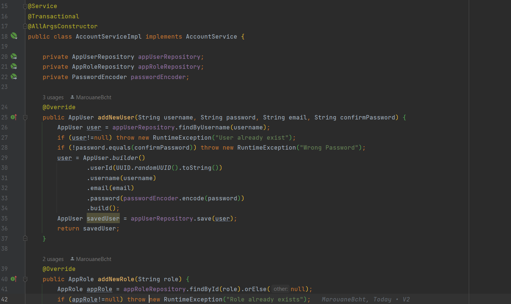

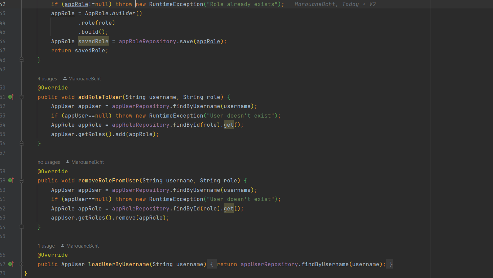

 

<h4>UserDetailsServiceImpl.java</h4>

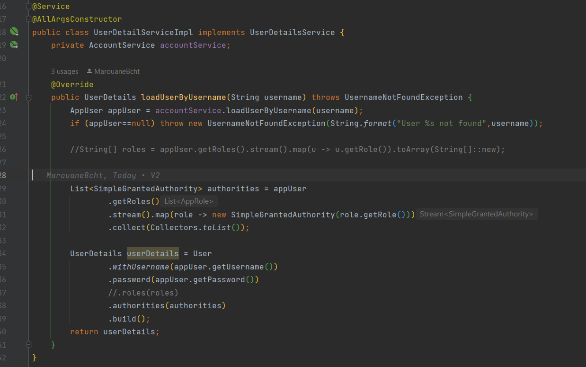

 

Pour Security Config nous allons utiliser passwordEncoder et SecurityFilterChain et l'injection de userDetailsServiceImpl de type UserDetailsServiceImpl:

<h4>SecurityConfigUser.java</h4>

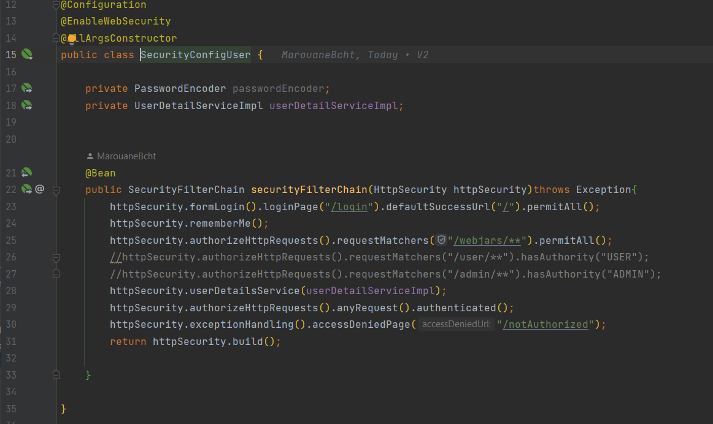

 

Définir les roles ou les autorisations:
<h4>PatientController.java</h4>

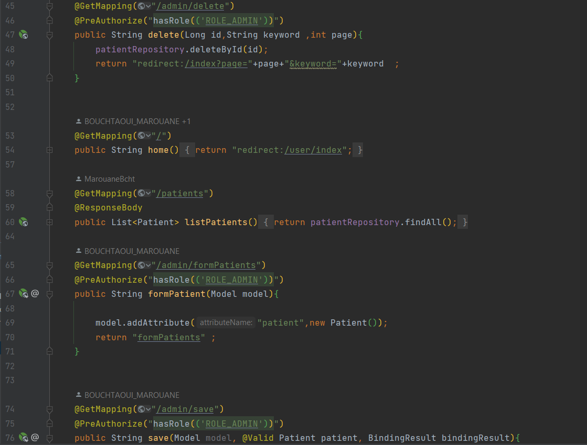

 

Test:

<h4>CommandLineRunnerUserDetails</h4>

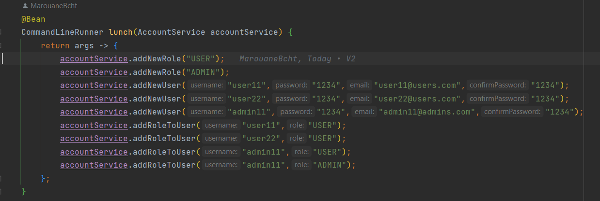

 

<h4>SecurityRestController.java</h4>

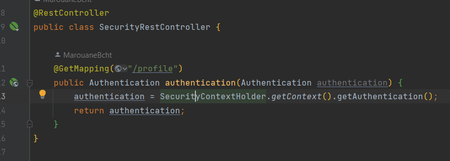

 

Message d'erreur pour les tentatives d'authentification échouées:

<h4>login.html</h4>

